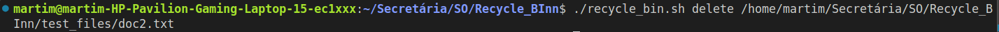
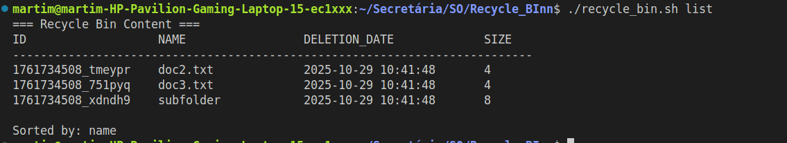
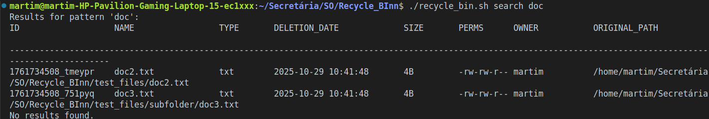
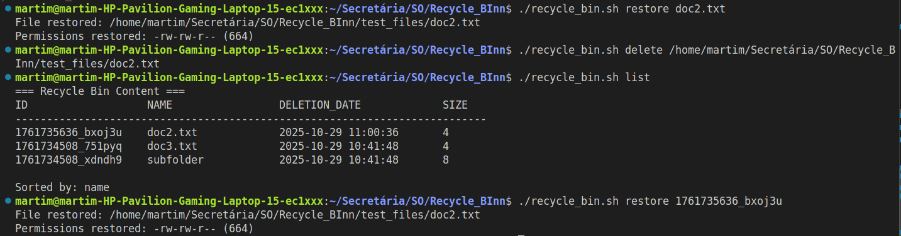
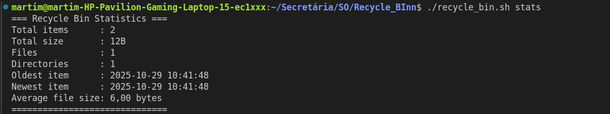

# Recycle_Bin
# Linux Recycle Bin System

## Author
Nuno Costa
125120
Martim Dias 
125925

## Description
This project implements a Recycle Bin system in Linux using Bash scripting.  
It simulates a modern trash/recycle system, allowing users to safely delete files, restore them, view the recycle bin contents, generate statistics, and automatically clean old files according to configurable policies.

## Installation
C1. Clone this repository:
   git clone https://github.com/mtravesso/Recycle_Bin.git
   cd Recycle_Bin
   chmod +x recycle_bin.sh

## Usage
Delete a file:
    ./recycle_bin.sh delete file.txt

List recycle bin contents:
    ./recycle_bin.sh list

Restore a deleted file:
    ./recycle_bin.sh restore <file_id>

Search by name, type, or date:
    ./recycle_bin.sh search "report"
    ./recycle_bin.sh search date "2024-05-01" "2024-05-31"

Show statistics:
    ./recycle_bin.sh stats

Run automatic cleanup:
    ./recycle_bin.sh cleanup

## Features
-Delete and restore files
-List files in a formatted table (sortable by name, date, or size)
-Search by name, extension, file type, or date range
-Generate statistics (total files, total size, file type distribution, etc.)
-utomatic cleanup of files older than a set number of days
-Quota management that remove old files when the bin exceeds 1 GB
-Preview the first 10 lines of text files
-Custom configuration through config.txt

## Configuration
Default settings are hardcoded in the script:
    -Maximum recycle bin size: 1 GB
    -Automatic cleanup is triggered when the quota(30 days) is exceeded.

## Examples
./recycle_bin.sh delete doc2.txt

./recycle_bin.sh list

./recycle_bin.sh search doc

./recycle_bin.sh preview doc2.txt

./recycle_bin.sh restore doc2.txt

./recycle_bin.sh stats

## Known Issues
File metadata (like deletion date) is limited; 
No versioning or backup history.
If the metadata file grows too large, search and sorting operations may slow down significantly.

## References
Files that the Professor made available on elearning
Videos from youtube:
    -https://www.youtube.com/watch?v=2733cRPudvI&list=PLT98CRl2KxKGj-VKtApD8-zCqSaN2mD4w (and others from the same youtube channel)
    -https://man7.org/linux/man-pages/man1/du.1.html?utm_source=chatgpt.com
    -https://www.geeksforgeeks.org/du-command-in-linux-with-examples/
    -https://www.geeksforgeeks.org/linux-unix/stat-command-in-linux-with-examples/
    -https://labex.io/linuxjourney

