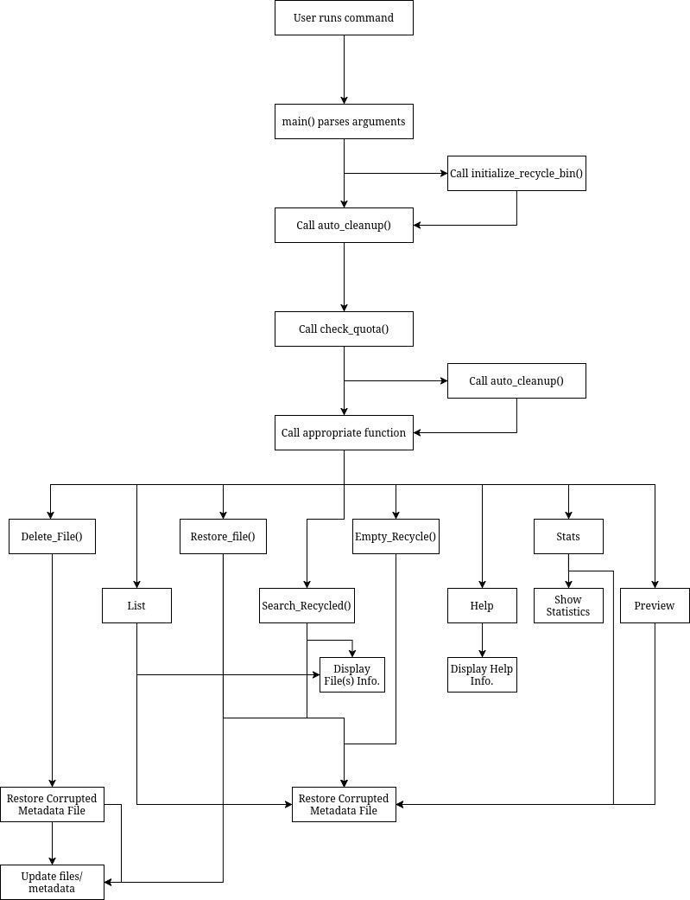
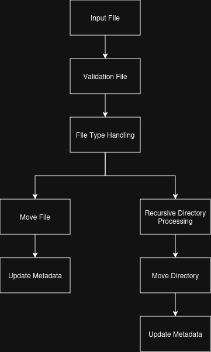
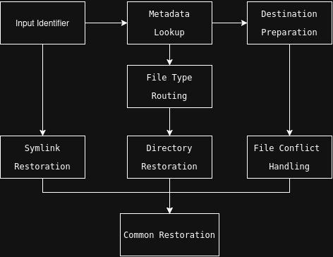
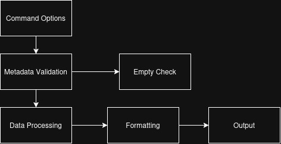
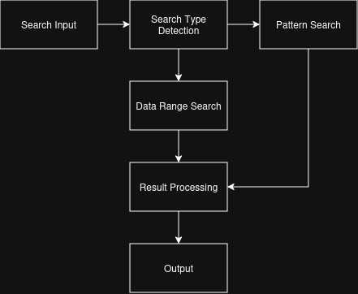
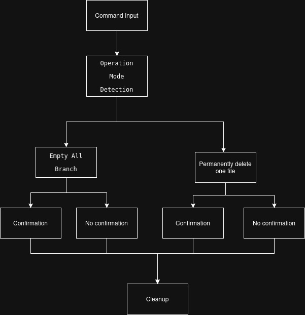
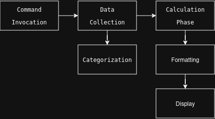
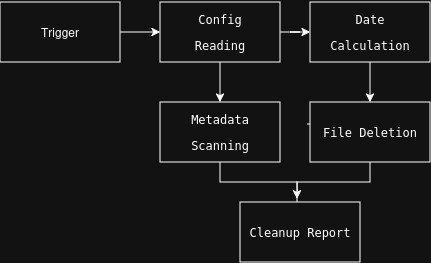
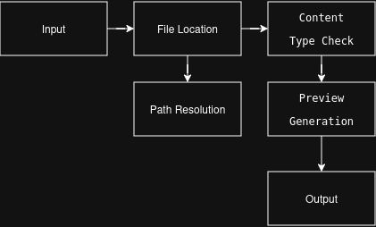
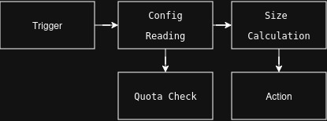

# TECHNICAL_DOC.md  
## Linux Recycle Bin Simulation

### 1. System Architecture Diagram

### 2. Data Flow Diagrams

#### **File Deletion Data Flow**

#### **File Restoration Data Flow**  

#### **File List Data Flow** 

#### **File Search Data Flow** 

#### **Empty Recycle Bin Data Flow**  

#### **Show Statistics Data Flow**  

#### **Cleanup Data Flow**

#### **Preview File Data Flow**

#### **Check quota Data Flow**
